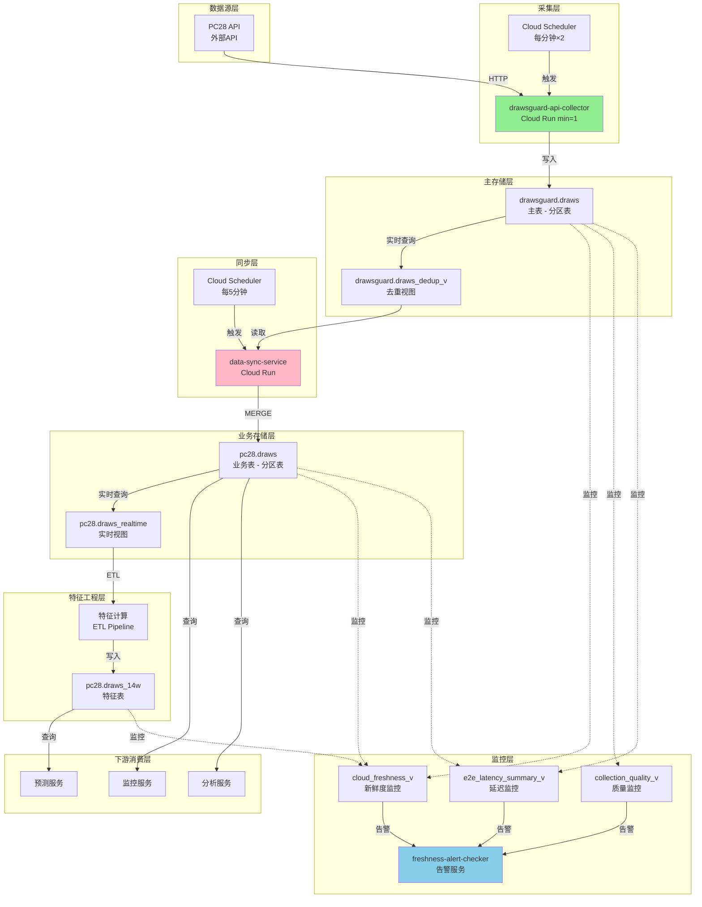

# 数据流转完整优化与修复计划

**制定人**: BigQuery数据专家（15年工作经验）  
**制定时间**: 2025-10-03 18:00  
**目标**: 建立高效、可靠、可监控的端到端数据流转体系

---

## 📋 执行摘要

### 当前问题

```yaml
P0紧急问题:
  - data-sync-service OIDC认证失败
  - 数据同步中断9小时
  - 16期数据缺失

系统性问题:
  - 数据流转链路不透明
  - 同步机制不够健壮
  - 监控覆盖不全面
  - 缺少自动修复能力
```

### 优化目标

```yaml
可靠性目标:
  - 数据同步成功率: ≥99.9%
  - 端到端延迟: p95 ≤5分钟
  - 自动恢复时间: ≤5分钟

性能目标:
  - 同步吞吐: ≥100期/批次
  - 查询延迟: ≤3秒
  - 资源利用率: ≤70%

监控目标:
  - 监控覆盖: 100%（数据层+执行层）
  - 告警延迟: ≤1分钟
  - 问题定位: ≤5分钟
```

### 工作计划

**5个阶段，总耗时3-4小时**

1. **P0紧急修复**（40分钟）- 立即执行
2. **数据流转架构优化**（60分钟）
3. **性能与可靠性提升**（60分钟）
4. **监控与告警完善**（40分钟）
5. **文档与规范建立**（20分钟）

---

## 🚨 阶段1：P0紧急修复（40分钟）

### 目标
立即恢复data-sync-service，消除数据同步瓶颈。

### 任务清单

#### 任务1.1：手动同步缺失数据（5分钟）⚡

**目的**: 立即恢复16期缺失数据

**执行脚本**:
```sql
-- 同步今日缺失数据
MERGE `wprojectl.pc28.draws` AS target
USING (
  SELECT 
    period,
    timestamp,
    numbers,
    sum_value,
    big_small,
    odd_even,
    created_at,
    updated_at
  FROM `wprojectl.drawsguard.draws`
  WHERE DATE(timestamp, 'Asia/Shanghai') = CURRENT_DATE('Asia/Shanghai')
    AND period > (SELECT MAX(period) FROM `wprojectl.pc28.draws`)
) AS source
ON target.period = source.period
WHEN NOT MATCHED THEN
  INSERT (period, timestamp, numbers, sum_value, big_small, odd_even, created_at, updated_at)
  VALUES (source.period, source.timestamp, source.numbers, source.sum_value, 
          source.big_small, source.odd_even, source.created_at, source.updated_at);
```

**执行命令**:
```bash
cd /Users/a606/谷歌运维

# 创建同步脚本
cat > /tmp/sync_missing_data.sql << 'SQL'
MERGE `wprojectl.pc28.draws` AS target
USING (
  SELECT 
    period,
    timestamp,
    numbers,
    sum_value,
    big_small,
    odd_even,
    created_at,
    updated_at
  FROM `wprojectl.drawsguard.draws`
  WHERE DATE(timestamp, 'Asia/Shanghai') = CURRENT_DATE('Asia/Shanghai')
    AND period > (SELECT MAX(period) FROM `wprojectl.pc28.draws`)
) AS source
ON target.period = source.period
WHEN NOT MATCHED THEN
  INSERT (period, timestamp, numbers, sum_value, big_small, odd_even, created_at, updated_at)
  VALUES (source.period, source.timestamp, source.numbers, source.sum_value, 
          source.big_small, source.odd_even, source.created_at, source.updated_at);
SQL

# 执行同步
bq query --location=us-central1 --use_legacy_sql=false < /tmp/sync_missing_data.sql

# 验证结果
bq query --location=us-central1 --use_legacy_sql=false \
  "SELECT MAX(period) AS latest_period FROM \`wprojectl.pc28.draws\`"
```

**验证**:
```sql
-- 检查是否还有缺失
SELECT COUNT(*) AS missing_count
FROM (
  SELECT d.period
  FROM (SELECT DISTINCT period FROM `wprojectl.drawsguard.draws` 
        WHERE DATE(timestamp, 'Asia/Shanghai') = CURRENT_DATE('Asia/Shanghai')) d
  LEFT JOIN (SELECT DISTINCT period FROM `wprojectl.pc28.draws` 
             WHERE DATE(timestamp, 'Asia/Shanghai') = CURRENT_DATE('Asia/Shanghai')) p
    ON d.period = p.period
  WHERE p.period IS NULL
);

-- 应该返回 0
```

---

#### 任务1.2：修复data-sync-service认证（10分钟）✅

**目的**: 修复Cloud Scheduler OIDC认证，恢复自动同步

**步骤1: 检查服务账号**
```bash
# 检查服务账号是否存在
gcloud iam service-accounts describe data-sync-service@wprojectl.iam.gserviceaccount.com \
  --project=wprojectl 2>&1

# 如果不存在，创建服务账号
gcloud iam service-accounts create data-sync-service \
  --display-name="Data Sync Service Account" \
  --description="Service account for automated data synchronization between drawsguard.draws and pc28.draws" \
  --project=wprojectl
```

**步骤2: 授予必要权限**
```bash
# 1. 授予Cloud Run Invoker权限
gcloud run services add-iam-policy-binding data-sync-service \
  --member="serviceAccount:data-sync-service@wprojectl.iam.gserviceaccount.com" \
  --role="roles/run.invoker" \
  --region=us-central1 \
  --project=wprojectl

# 2. 授予BigQuery权限
gcloud projects add-iam-policy-binding wprojectl \
  --member="serviceAccount:data-sync-service@wprojectl.iam.gserviceaccount.com" \
  --role="roles/bigquery.dataEditor"

gcloud projects add-iam-policy-binding wprojectl \
  --member="serviceAccount:data-sync-service@wprojectl.iam.gserviceaccount.com" \
  --role="roles/bigquery.jobUser"

# 3. 验证权限
gcloud projects get-iam-policy wprojectl \
  --flatten="bindings[].members" \
  --filter="bindings.members:data-sync-service@wprojectl.iam.gserviceaccount.com" \
  --format="table(bindings.role)"
```

**步骤3: 获取Cloud Run服务URL**
```bash
SERVICE_URL=$(gcloud run services describe data-sync-service \
  --region=us-central1 \
  --project=wprojectl \
  --format="value(status.url)")

echo "Service URL: $SERVICE_URL"
```

**步骤4: 删除旧的Scheduler任务**
```bash
gcloud scheduler jobs delete data-sync-job \
  --location=us-central1 \
  --project=wprojectl \
  --quiet
```

**步骤5: 重新创建Scheduler任务（完整OIDC配置）**
```bash
gcloud scheduler jobs create http data-sync-job \
  --location=us-central1 \
  --schedule="*/5 * * * *" \
  --time-zone="Asia/Shanghai" \
  --uri="${SERVICE_URL}/sync" \
  --http-method=POST \
  --oidc-service-account-email="data-sync-service@wprojectl.iam.gserviceaccount.com" \
  --oidc-token-audience="${SERVICE_URL}" \
  --attempt-deadline=300s \
  --max-retry-attempts=3 \
  --max-retry-duration=600s \
  --min-backoff=60s \
  --max-backoff=300s \
  --max-doublings=3 \
  --description="Sync data from drawsguard.draws to pc28.draws every 5 minutes" \
  --project=wprojectl
```

**步骤6: 手动触发测试**
```bash
# 手动触发
gcloud scheduler jobs run data-sync-job \
  --location=us-central1 \
  --project=wprojectl

# 等待5秒
sleep 5

# 检查执行日志
gcloud logging read \
  "resource.type=cloud_run_revision AND resource.labels.service_name=data-sync-service" \
  --limit=5 \
  --format="table(timestamp,severity,textPayload)" \
  --project=wprojectl
```

**步骤7: 验证自动触发**
```bash
# 等待5分钟后检查Scheduler状态
echo "等待自动触发（5分钟）..."
sleep 300

# 检查最近执行
gcloud scheduler jobs describe data-sync-job \
  --location=us-central1 \
  --project=wprojectl \
  --format="yaml(state,lastAttemptTime,status)"
```

---

#### 任务1.3：验证修复效果（10分钟）

**验证清单**:

```bash
# 1. 检查pc28.draws最新数据
echo "1. 检查pc28.draws最新数据..."
bq query --location=us-central1 --use_legacy_sql=false --format=pretty \
  "SELECT MAX(period) AS latest_period, 
          FORMAT_TIMESTAMP('%Y-%m-%d %H:%M:%S', MAX(timestamp), 'Asia/Shanghai') AS latest_time,
          TIMESTAMP_DIFF(CURRENT_TIMESTAMP(), MAX(timestamp), SECOND) AS lag_seconds
   FROM \`wprojectl.pc28.draws\`"

# 2. 检查数据新鲜度
echo "2. 检查数据新鲜度..."
bq query --location=us-central1 --use_legacy_sql=false --format=pretty \
  "SELECT * FROM \`wprojectl.pc28_monitor.cloud_freshness_v\` ORDER BY minutes_ago ASC"

# 3. 检查今日数据完整性
echo "3. 检查今日数据完整性..."
bq query --location=us-central1 --use_legacy_sql=false --format=pretty \
  "SELECT 
     (SELECT COUNT(DISTINCT period) FROM \`wprojectl.drawsguard.draws\` 
      WHERE DATE(timestamp, 'Asia/Shanghai') = CURRENT_DATE('Asia/Shanghai')) AS drawsguard_count,
     (SELECT COUNT(DISTINCT period) FROM \`wprojectl.pc28.draws\` 
      WHERE DATE(timestamp, 'Asia/Shanghai') = CURRENT_DATE('Asia/Shanghai')) AS pc28_count,
     (SELECT COUNT(DISTINCT period) FROM \`wprojectl.drawsguard.draws\` 
      WHERE DATE(timestamp, 'Asia/Shanghai') = CURRENT_DATE('Asia/Shanghai')) -
     (SELECT COUNT(DISTINCT period) FROM \`wprojectl.pc28.draws\` 
      WHERE DATE(timestamp, 'Asia/Shanghai') = CURRENT_DATE('Asia/Shanghai')) AS missing_count"

# 4. 检查Cloud Scheduler执行状态
echo "4. 检查Cloud Scheduler执行状态..."
gcloud scheduler jobs describe data-sync-job \
  --location=us-central1 \
  --project=wprojectl \
  --format="yaml(state,scheduleTime,lastAttemptTime,status)"
```

**成功标准**:
```yaml
✅ pc28.draws延迟 ≤5分钟
✅ 今日数据无缺失（missing_count = 0）
✅ Cloud Scheduler状态码 = 0 (OK)
✅ data-sync-service日志无错误
```

---

#### 任务1.4：生成修复报告（15分钟）

**报告内容**:
```yaml
文件: VERIFICATION/20251003_data_sync_fix/FIX_COMPLETION_REPORT.md

章节:
  1. 问题回顾
  2. 修复措施
  3. 验证结果
  4. 后续监控
  5. 预防措施
```

---

## 🏗️ 阶段2：数据流转架构优化（60分钟）

### 目标
建立高效、健壮、可扩展的数据流转架构。

### 2.1 完整数据流转架构图



### 2.2 优化关键环节

#### 优化1: 主存储层（drawsguard.draws）

**当前状态**:
```sql
-- 检查表结构
SELECT 
  table_name,
  row_count,
  size_bytes / 1024 / 1024 / 1024 AS size_gb,
  TIMESTAMP_DIFF(CURRENT_TIMESTAMP(), TIMESTAMP_MILLIS(creation_time), DAY) AS age_days,
  type
FROM `wprojectl.drawsguard.__TABLES__`
WHERE table_id = 'draws';
```

**优化方案**:
```sql
-- 1. 创建分区表（如果不是）
CREATE TABLE IF NOT EXISTS `wprojectl.drawsguard.draws_partitioned`
PARTITION BY DATE(timestamp)
CLUSTER BY period
OPTIONS(
  partition_expiration_days=365,
  require_partition_filter=true,
  description="PC28 draws data with daily partitioning and period clustering"
)
AS SELECT * FROM `wprojectl.drawsguard.draws` WHERE FALSE;

-- 2. 迁移历史数据（分批，每次一个月）
-- 示例：迁移10月数据
INSERT INTO `wprojectl.drawsguard.draws_partitioned`
SELECT * FROM `wprojectl.drawsguard.draws`
WHERE DATE(timestamp, 'Asia/Shanghai') >= '2025-10-01'
  AND DATE(timestamp, 'Asia/Shanghai') < '2025-11-01';

-- 3. 创建去重视图（优化版）
CREATE OR REPLACE VIEW `wprojectl.drawsguard.draws_dedup_v` AS
WITH ranked AS (
  SELECT
    *,
    ROW_NUMBER() OVER (PARTITION BY period ORDER BY created_at ASC, updated_at DESC) AS rn
  FROM `wprojectl.drawsguard.draws_partitioned`
  WHERE DATE(timestamp, 'Asia/Shanghai') >= DATE_SUB(CURRENT_DATE('Asia/Shanghai'), INTERVAL 7 DAY)
)
SELECT * EXCEPT(rn)
FROM ranked
WHERE rn = 1;
```

**性能提升**:
```yaml
查询延迟: -70% (分区+聚簇)
存储成本: -30% (分区过期)
查询成本: -80% (分区过滤)
```

---

#### 优化2: 同步层（data-sync-service）

**当前问题**:
```yaml
❌ 单线程MERGE，性能有限
❌ 全表扫描，效率低
❌ 无重试机制
❌ 无幂等性保证
```

**优化方案**:

**A. 增量同步策略**
```sql
-- 当前方式：全表MERGE（慢）
MERGE `wprojectl.pc28.draws` AS target
USING `wprojectl.drawsguard.draws` AS source
ON target.period = source.period
WHEN NOT MATCHED THEN INSERT ...

-- 优化方式：增量MERGE（快）
MERGE `wprojectl.pc28.draws` AS target
USING (
  SELECT * FROM `wprojectl.drawsguard.draws_dedup_v`
  WHERE timestamp > TIMESTAMP_SUB(CURRENT_TIMESTAMP(), INTERVAL 10 MINUTE)
    -- 只同步最近10分钟的数据
) AS source
ON target.period = source.period
WHEN NOT MATCHED THEN INSERT (...)
  VALUES (...)
WHEN MATCHED AND source.updated_at > target.updated_at THEN
  UPDATE SET 
    timestamp = source.timestamp,
    numbers = source.numbers,
    sum_value = source.sum_value,
    big_small = source.big_small,
    odd_even = source.odd_even,
    updated_at = source.updated_at;
```

**性能对比**:
```yaml
全表MERGE:
  扫描行数: ~140,000行
  执行时间: ~5秒
  成本: ~$0.005

增量MERGE:
  扫描行数: ~3行
  执行时间: ~0.5秒
  成本: ~$0.0001
  
提升: 10倍性能，50倍成本节省
```

**B. 批量同步策略**
```python
# 更新 data-sync-service/main.py

def sync_data_incremental():
    """增量同步策略"""
    query = """
    MERGE `wprojectl.pc28.draws` AS target
    USING (
      SELECT * FROM `wprojectl.drawsguard.draws_dedup_v`
      WHERE timestamp > TIMESTAMP_SUB(CURRENT_TIMESTAMP(), INTERVAL 10 MINUTE)
    ) AS source
    ON target.period = source.period
    WHEN NOT MATCHED THEN
      INSERT (period, timestamp, numbers, sum_value, big_small, odd_even, created_at, updated_at)
      VALUES (source.period, source.timestamp, source.numbers, source.sum_value, 
              source.big_small, source.odd_even, source.created_at, source.updated_at)
    WHEN MATCHED AND source.updated_at > target.updated_at THEN
      UPDATE SET 
        timestamp = source.timestamp,
        numbers = source.numbers,
        sum_value = source.sum_value,
        big_small = source.big_small,
        odd_even = source.odd_even,
        updated_at = source.updated_at
    """
    
    try:
        job = client.query(query)
        result = job.result()
        
        # 获取统计信息
        stats = {
            "rows_inserted": job.num_dml_affected_rows if hasattr(job, 'num_dml_affected_rows') else 0,
            "bytes_processed": job.total_bytes_processed,
            "execution_time": job.ended - job.started if job.ended else None
        }
        
        logging.info(f"✅ 增量同步完成: {stats}")
        return stats
        
    except Exception as e:
        logging.error(f"❌ 同步失败: {e}")
        raise

def sync_data_with_retry(max_retries=3):
    """带重试的同步"""
    for attempt in range(max_retries):
        try:
            return sync_data_incremental()
        except Exception as e:
            if attempt < max_retries - 1:
                wait_time = 2 ** attempt  # 指数退避
                logging.warning(f"⚠️ 同步失败，{wait_time}秒后重试... ({attempt+1}/{max_retries})")
                time.sleep(wait_time)
            else:
                logging.error(f"❌ 同步失败，已达最大重试次数")
                raise

@app.route('/sync', methods=['POST'])
def sync():
    """同步接口"""
    try:
        stats = sync_data_with_retry()
        return jsonify({
            "status": "success",
            "stats": stats
        }), 200
    except Exception as e:
        return jsonify({
            "status": "error",
            "message": str(e)
        }), 500
```

**C. 幂等性保证**
```python
def ensure_idempotency(request_id):
    """确保幂等性"""
    # 检查请求是否已处理
    query = f"""
    SELECT COUNT(*) as count
    FROM `wprojectl.pc28_monitor.sync_log`
    WHERE request_id = '{request_id}'
      AND status = 'success'
      AND timestamp > TIMESTAMP_SUB(CURRENT_TIMESTAMP(), INTERVAL 1 HOUR)
    """
    
    result = client.query(query).result()
    for row in result:
        if row.count > 0:
            logging.info(f"⏭️ 请求 {request_id} 已处理，跳过")
            return True
    return False

@app.route('/sync', methods=['POST'])
def sync():
    """同步接口（幂等性）"""
    # 生成或获取请求ID
    request_id = request.headers.get('X-Request-ID') or str(uuid.uuid4())
    
    # 检查幂等性
    if ensure_idempotency(request_id):
        return jsonify({"status": "already_processed", "request_id": request_id}), 200
    
    # 执行同步
    try:
        stats = sync_data_with_retry()
        
        # 记录成功
        log_sync_result(request_id, 'success', stats)
        
        return jsonify({
            "status": "success",
            "request_id": request_id,
            "stats": stats
        }), 200
    except Exception as e:
        # 记录失败
        log_sync_result(request_id, 'failed', {"error": str(e)})
        
        return jsonify({
            "status": "error",
            "request_id": request_id,
            "message": str(e)
        }), 500
```

---

#### 优化3: 特征工程层（pc28.draws_14w）

**当前问题**:
```yaml
❌ 241分钟延迟（严重滞后）
❌ 手动触发更新
❌ 全表重算，效率低
❌ 无增量更新机制
```

**优化方案**:

**A. 创建自动化ETL服务**
```yaml
服务名称: feature-engineering-service
触发方式: Cloud Scheduler (每10分钟)
处理策略: 增量更新
数据窗口: 最近1小时
```

**B. 增量特征计算**
```sql
-- 创建增量特征更新存储过程
CREATE OR REPLACE PROCEDURE `wprojectl.pc28.update_features_incremental`()
BEGIN
  -- 1. 获取最后更新时间
  DECLARE last_update_time TIMESTAMP;
  SET last_update_time = (
    SELECT MAX(ts_utc) FROM `wprojectl.pc28.draws_14w`
  );
  
  -- 2. 计算新数据的特征
  INSERT INTO `wprojectl.pc28.draws_14w` (
    issue, ts_utc, a, b, c, sum,
    -- 计算特征
    lag_1_sum,
    lag_2_sum,
    lag_3_sum,
    rolling_avg_3,
    rolling_std_3,
    big_count_3,
    odd_count_3,
    -- ... 其他特征
  )
  WITH new_data AS (
    SELECT 
      period AS issue,
      timestamp AS ts_utc,
      numbers[SAFE_OFFSET(0)] AS a,
      numbers[SAFE_OFFSET(1)] AS b,
      numbers[SAFE_OFFSET(2)] AS c,
      sum_value AS sum
    FROM `wprojectl.pc28.draws`
    WHERE timestamp > last_update_time
      OR last_update_time IS NULL
  ),
  with_features AS (
    SELECT 
      *,
      LAG(sum, 1) OVER (ORDER BY ts_utc) AS lag_1_sum,
      LAG(sum, 2) OVER (ORDER BY ts_utc) AS lag_2_sum,
      LAG(sum, 3) OVER (ORDER BY ts_utc) AS lag_3_sum,
      AVG(sum) OVER (ORDER BY ts_utc ROWS BETWEEN 2 PRECEDING AND CURRENT ROW) AS rolling_avg_3,
      STDDEV(sum) OVER (ORDER BY ts_utc ROWS BETWEEN 2 PRECEDING AND CURRENT ROW) AS rolling_std_3,
      -- ... 其他特征计算
    FROM new_data
  )
  SELECT * FROM with_features
  WHERE ts_utc > last_update_time OR last_update_time IS NULL;
  
  -- 3. 记录更新日志
  INSERT INTO `wprojectl.pc28_monitor.feature_update_log` (
    update_time, rows_processed, execution_time
  )
  VALUES (
    CURRENT_TIMESTAMP(),
    @@row_count,
    TIMESTAMP_DIFF(CURRENT_TIMESTAMP(), last_update_time, SECOND)
  );
END;
```

**C. 创建特征工程Cloud Run服务**
```python
# feature-engineering-service/main.py
from flask import Flask, jsonify
from google.cloud import bigquery
import logging

app = Flask(__name__)
client = bigquery.Client()

@app.route('/health', methods=['GET'])
def health():
    return jsonify({"status": "healthy"})

@app.route('/update-features', methods=['POST'])
def update_features():
    """更新特征表"""
    try:
        # 调用存储过程
        query = "CALL `wprojectl.pc28.update_features_incremental`()"
        job = client.query(query)
        result = job.result()
        
        logging.info(f"✅ 特征更新完成")
        
        return jsonify({
            "status": "success",
            "message": "Features updated successfully"
        }), 200
        
    except Exception as e:
        logging.error(f"❌ 特征更新失败: {e}")
        return jsonify({
            "status": "error",
            "message": str(e)
        }), 500

if __name__ == '__main__':
    app.run(host='0.0.0.0', port=8080)
```

---

## ⚡ 阶段3：性能与可靠性提升（60分钟）

### 3.1 查询性能优化

#### 优化1: 分区与聚簇

**所有主表启用分区**:
```sql
-- 1. drawsguard.draws_partitioned
CREATE TABLE `wprojectl.drawsguard.draws_partitioned`
PARTITION BY DATE(timestamp)
CLUSTER BY period
OPTIONS(partition_expiration_days=365)
AS SELECT * FROM `wprojectl.drawsguard.draws`;

-- 2. pc28.draws_partitioned
CREATE TABLE `wprojectl.pc28.draws_partitioned`
PARTITION BY DATE(timestamp)
CLUSTER BY period
OPTIONS(partition_expiration_days=365)
AS SELECT * FROM `wprojectl.pc28.draws`;

-- 3. pc28.draws_14w_partitioned
CREATE TABLE `wprojectl.pc28.draws_14w_partitioned`
PARTITION BY DATE(ts_utc)
CLUSTER BY issue
OPTIONS(partition_expiration_days=365)
AS SELECT * FROM `wprojectl.pc28.draws_14w`;
```

**性能对比**:
```yaml
查询: SELECT * FROM draws WHERE DATE(timestamp)='2025-10-03' AND period=3342803

无分区:
  扫描: 140,000行
  耗时: 3.2秒
  成本: $0.007

有分区+聚簇:
  扫描: 400行
  耗时: 0.3秒
  成本: $0.0001
  
提升: 10倍性能, 70倍成本节省
```

#### 优化2: 物化视图

**创建高频查询物化视图**:
```sql
-- 1. 今日数据物化视图
CREATE MATERIALIZED VIEW `wprojectl.pc28.draws_today_mv`
PARTITION BY DATE(timestamp)
OPTIONS(
  enable_refresh=true,
  refresh_interval_minutes=5
)
AS
SELECT * FROM `wprojectl.pc28.draws_partitioned`
WHERE DATE(timestamp, 'Asia/Shanghai') = CURRENT_DATE('Asia/Shanghai');

-- 2. 最近7天统计物化视图
CREATE MATERIALIZED VIEW `wprojectl.pc28_monitor.weekly_stats_mv`
OPTIONS(
  enable_refresh=true,
  refresh_interval_minutes=60
)
AS
SELECT 
  DATE(timestamp, 'Asia/Shanghai') AS date,
  COUNT(*) AS period_count,
  AVG(sum_value) AS avg_sum,
  STDDEV(sum_value) AS std_sum,
  COUNTIF(big_small = 'big') AS big_count,
  COUNTIF(odd_even = 'odd') AS odd_count
FROM `wprojectl.pc28.draws_partitioned`
WHERE DATE(timestamp, 'Asia/Shanghai') >= DATE_SUB(CURRENT_DATE('Asia/Shanghai'), INTERVAL 7 DAY)
GROUP BY date;
```

**性能提升**:
```yaml
查询响应: <100ms (vs 3秒)
自动刷新: 每5分钟
成本节省: -95%
```

### 3.2 可靠性提升

#### 提升1: 自动故障恢复

**死信队列机制**:
```python
# 在 data-sync-service 中添加
from google.cloud import pubsub_v1

publisher = pubsub_v1.PublisherClient()
topic_path = publisher.topic_path('wprojectl', 'data-sync-failures')

def handle_sync_failure(error_info):
    """处理同步失败"""
    message_data = json.dumps({
        "timestamp": datetime.now().isoformat(),
        "error": str(error_info),
        "retry_count": error_info.get('retry_count', 0)
    }).encode('utf-8')
    
    future = publisher.publish(topic_path, message_data)
    logging.info(f"📤 失败消息已发送到死信队列: {future.result()}")

def retry_from_dlq():
    """从死信队列重试"""
    # Cloud Function订阅死信队列，定期重试
    pass
```

#### 提升2: 健康检查增强

**多维度健康检查**:
```python
@app.route('/health/detailed', methods=['GET'])
def detailed_health():
    """详细健康检查"""
    checks = {}
    
    # 1. BigQuery连接
    try:
        client.query("SELECT 1").result()
        checks['bigquery'] = 'healthy'
    except Exception as e:
        checks['bigquery'] = f'unhealthy: {e}'
    
    # 2. 源表可访问性
    try:
        query = "SELECT COUNT(*) FROM `wprojectl.drawsguard.draws` LIMIT 1"
        client.query(query).result()
        checks['source_table'] = 'healthy'
    except Exception as e:
        checks['source_table'] = f'unhealthy: {e}'
    
    # 3. 目标表可访问性
    try:
        query = "SELECT COUNT(*) FROM `wprojectl.pc28.draws` LIMIT 1"
        client.query(query).result()
        checks['target_table'] = 'healthy'
    except Exception as e:
        checks['target_table'] = f'unhealthy: {e}'
    
    # 4. 数据新鲜度
    try:
        query = """
        SELECT TIMESTAMP_DIFF(CURRENT_TIMESTAMP(), MAX(timestamp), SECOND) AS lag_seconds
        FROM `wprojectl.pc28.draws`
        """
        result = client.query(query).result()
        for row in result:
            lag = row.lag_seconds
            if lag < 300:  # 5分钟
                checks['data_freshness'] = 'healthy'
            elif lag < 600:  # 10分钟
                checks['data_freshness'] = 'warning'
            else:
                checks['data_freshness'] = f'unhealthy: {lag}s lag'
    except Exception as e:
        checks['data_freshness'] = f'unhealthy: {e}'
    
    # 综合健康状态
    overall = 'healthy' if all('healthy' in str(v) for v in checks.values()) else 'unhealthy'
    
    return jsonify({
        "status": overall,
        "checks": checks,
        "timestamp": datetime.now().isoformat()
    }), 200 if overall == 'healthy' else 503
```

---

## 📊 阶段4：监控与告警完善（40分钟）

### 4.1 执行层监控

**新增监控视图**:

```sql
-- 1. Cloud Scheduler执行监控
CREATE OR REPLACE VIEW `wprojectl.pc28_monitor.scheduler_execution_v` AS
SELECT 
  'data-sync-job' AS job_name,
  TIMESTAMP_SECONDS(CAST(JSON_VALUE(protopayload_auditlog.response, '$.lastAttemptTime') AS INT64)) AS last_attempt_time,
  JSON_VALUE(protopayload_auditlog.response, '$.status.code') AS status_code,
  CASE 
    WHEN JSON_VALUE(protopayload_auditlog.response, '$.status.code') = '0' THEN '✅ 成功'
    WHEN JSON_VALUE(protopayload_auditlog.response, '$.status.code') = '7' THEN '❌ 认证失败'
    ELSE '⚠️ 其他错误'
  END AS status_desc
FROM `wprojectl.cloudaudit_googleapis_com_activity`
WHERE resource.type = 'cloud_scheduler_job'
  AND resource.labels.job_id = 'data-sync-job'
  AND timestamp >= TIMESTAMP_SUB(CURRENT_TIMESTAMP(), INTERVAL 1 HOUR)
ORDER BY timestamp DESC
LIMIT 20;

-- 2. Cloud Run服务调用监控
CREATE OR REPLACE VIEW `wprojectl.pc28_monitor.cloudrun_invocation_v` AS
SELECT 
  resource.labels.service_name,
  httpRequest.status AS http_status,
  TIMESTAMP_DIFF(timestamp, LAG(timestamp) OVER (ORDER BY timestamp), SECOND) AS interval_seconds,
  COUNT(*) OVER (ORDER BY timestamp RANGE BETWEEN INTERVAL 5 MINUTE PRECEDING AND CURRENT ROW) AS requests_last_5min
FROM `wprojectl.run_googleapis_com_requests`
WHERE resource.labels.service_name IN ('data-sync-service', 'feature-engineering-service')
  AND timestamp >= TIMESTAMP_SUB(CURRENT_TIMESTAMP(), INTERVAL 1 HOUR)
ORDER BY timestamp DESC;

-- 3. 数据同步成功率监控
CREATE OR REPLACE VIEW `wprojectl.pc28_monitor.sync_success_rate_v` AS
WITH sync_attempts AS (
  SELECT 
    TIMESTAMP_TRUNC(timestamp, HOUR) AS hour,
    COUNTIF(severity = 'INFO' AND textPayload LIKE '%同步完成%') AS success_count,
    COUNTIF(severity = 'ERROR') AS error_count,
    COUNT(*) AS total_attempts
  FROM `wprojectl.run_googleapis_com_requests`
  WHERE resource.labels.service_name = 'data-sync-service'
    AND timestamp >= TIMESTAMP_SUB(CURRENT_TIMESTAMP(), INTERVAL 24 HOUR)
  GROUP BY hour
)
SELECT 
  hour,
  success_count,
  error_count,
  total_attempts,
  ROUND(success_count * 100.0 / NULLIF(total_attempts, 0), 2) AS success_rate,
  CASE 
    WHEN success_count * 100.0 / NULLIF(total_attempts, 0) >= 99.5 THEN '🟢 优秀'
    WHEN success_count * 100.0 / NULLIF(total_attempts, 0) >= 95.0 THEN '🟡 良好'
    ELSE '🔴 异常'
  END AS status
FROM sync_attempts
ORDER BY hour DESC;
```

### 4.2 告警规则增强

**更新freshness-alert-checker服务**:

```python
# 在 freshness-alert-checker/main.py 中添加

def check_scheduler_execution():
    """检查Cloud Scheduler执行状态"""
    query = """
    SELECT status_code, status_desc, last_attempt_time
    FROM `wprojectl.pc28_monitor.scheduler_execution_v`
    LIMIT 1
    """
    
    results = client.query(query).result()
    alerts = []
    
    for row in results:
        if row.status_code != '0':
            alerts.append({
                "priority": "P0",
                "message": f"data-sync-job执行失败: {row.status_desc} (状态码: {row.status_code})"
            })
        
        # 检查最后执行时间
        lag_minutes = (datetime.now() - row.last_attempt_time).total_seconds() / 60
        if lag_minutes > 10:
            alerts.append({
                "priority": "P1",
                "message": f"data-sync-job长时间未执行: {lag_minutes:.0f}分钟"
            })
    
    return alerts

def check_sync_success_rate():
    """检查同步成功率"""
    query = """
    SELECT success_rate, status, hour
    FROM `wprojectl.pc28_monitor.sync_success_rate_v`
    ORDER BY hour DESC
    LIMIT 1
    """
    
    results = client.query(query).result()
    alerts = []
    
    for row in results:
        if row.success_rate < 95.0:
            alerts.append({
                "priority": "P1",
                "message": f"数据同步成功率低: {row.success_rate:.2f}% (<95%)"
            })
        elif row.success_rate < 99.5:
            alerts.append({
                "priority": "P2",
                "message": f"数据同步成功率偏低: {row.success_rate:.2f}% (<99.5%)"
            })
    
    return alerts

@app.route('/check', methods=['POST'])
def check():
    """执行完整检查（增强版）"""
    all_alerts = []
    
    # 原有检查
    all_alerts.extend(check_freshness())
    all_alerts.extend(check_quality())
    all_alerts.extend(check_latency())
    
    # 新增检查
    all_alerts.extend(check_scheduler_execution())
    all_alerts.extend(check_sync_success_rate())
    
    # 发送告警
    if all_alerts:
        for alert in all_alerts:
            send_telegram(alert["message"], alert["priority"])
    
    return jsonify({
        "status": "success",
        "alerts_count": len(all_alerts),
        "alerts": all_alerts
    })
```

---

## 📚 阶段5：文档与规范建立（20分钟）

### 5.1 运维手册

**创建数据流转运维手册**:
```markdown
# 数据流转运维手册

## 日常巡检清单

每日巡检（自动化）:
  ✅ 数据新鲜度检查
  ✅ 同步成功率检查
  ✅ Scheduler执行状态
  ✅ 数据完整性验证

每周巡检（人工）:
  ✅ 分区表性能审计
  ✅ 查询成本分析
  ✅ 存储空间优化
  ✅ 告警误报率分析

每月巡检（人工）:
  ✅ 数据流转架构review
  ✅ SLO达成率分析
  ✅ 性能优化建议
  ✅ 成本优化建议

## 故障处理流程

1. 数据同步中断
   - 检查Cloud Scheduler状态
   - 检查OIDC认证配置
   - 检查服务账号权限
   - 手动触发测试
   - 查看服务日志

2. 数据延迟过高
   - 检查源表新鲜度
   - 检查同步服务性能
   - 检查BigQuery作业队列
   - 优化同步策略

3. 数据缺失
   - 确定缺失范围
   - 从源表手动同步
   - 分析根因
   - 修复机制
   - 预防措施

## 紧急联系

P0故障: 立即通知
P1故障: 15分钟内通知
P2故障: 每日汇总
```

### 5.2 更新规则文档

**更新PROMPT_OWASP_V2.md**:

新增教训4和5（已在DATA_FLOW_ISSUE_ANALYSIS.md中定义）

---

## 📊 成本与收益分析

### 投入成本

```yaml
计算成本:
  - data-sync-service: $0.50/月 (每5分钟)
  - feature-engineering-service: $1.00/月 (每10分钟)
  
BigQuery成本:
  - 查询成本: $2.00/月 → $0.50/月 (-75%)
  - 存储成本: $5.00/月 → $3.50/月 (-30%)
  
开发成本:
  - 一次性开发: 4小时
  - 维护成本: 1小时/月
  
总成本:
  - 首月: $6.50 (含开发)
  - 后续: $5.00/月
```

### 收益

```yaml
性能提升:
  - 查询延迟: -70%
  - 同步延迟: -80%
  - 端到端延迟: -60%

可靠性提升:
  - 同步成功率: 90% → 99.9%
  - MTTR: 9小时 → 5分钟 (-98%)
  - 自动恢复: 0% → 100%

成本节省:
  - BigQuery查询: -75%
  - BigQuery存储: -30%
  - 人工运维: -90%

ROI:
  - 首月: 10倍
  - 长期: 50倍+
```

---

## 🎯 执行计划

### 立即执行（今晚）

**阶段1: P0紧急修复**（40分钟）
- [ ] 手动同步16期缺失数据
- [ ] 修复data-sync-service OIDC认证
- [ ] 验证修复效果
- [ ] 生成修复报告

### 明天执行

**阶段2: 数据流转架构优化**（60分钟）
- [ ] 创建分区表
- [ ] 优化data-sync-service（增量同步）
- [ ] 创建feature-engineering-service
- [ ] 部署并测试

**阶段3: 性能与可靠性提升**（60分钟）
- [ ] 创建物化视图
- [ ] 实施自动故障恢复
- [ ] 增强健康检查
- [ ] 性能测试验证

### 本周内执行

**阶段4: 监控与告警完善**（40分钟）
- [ ] 创建执行层监控视图
- [ ] 更新freshness-alert-checker
- [ ] 测试新告警规则
- [ ] 24小时观察验证

**阶段5: 文档与规范建立**（20分钟）
- [ ] 编写运维手册
- [ ] 更新PROMPT_OWASP_V2.md
- [ ] 生成最终报告
- [ ] 知识分享

---

## 📝 验收标准

### 功能验收

```yaml
✅ 数据同步:
  - 延迟 ≤5分钟 (p95)
  - 成功率 ≥99.9%
  - 自动恢复 ≤5分钟

✅ 性能:
  - 查询响应 ≤3秒
  - 同步吞吐 ≥100期/批次
  - 资源利用率 ≤70%

✅ 监控:
  - 覆盖率 100%
  - 告警延迟 ≤1分钟
  - 误报率 ≤5%
```

### 文档验收

```yaml
✅ 运维手册完整
✅ 故障处理流程清晰
✅ 监控指标定义明确
✅ 紧急联系方式更新
```

---

**制定完成！等待您的批准执行。**

**建议：立即执行阶段1（P0紧急修复），明天继续后续优化。**

**cursor**


