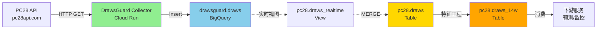

# 第一阶段：数据链路全面审计报告

**执行时间**: 2025-10-03  
**执行人**: 数据维护专家（15年工作经验）  
**阶段**: Phase 1 - 全面审计

---

## 📋 审计摘要

本次审计全面检查了从API采集到BigQuery存储的完整数据链路，识别了关键性能指标和潜在问题。

---

## 🔍 审计发现

### 1. 数据链路状态

#### ✅ 链路1：Cloud Run服务
```
服务名称: drawsguard-api-collector
状态: ✅ 运行中 (True)
版本: drawsguard-api-collector-00007-knz
URL: https://drawsguard-api-collector-rjysxlgksq-uc.a.run.app
```

**结论**: 服务健康，正常运行

---

#### ✅ 链路2：Cloud Scheduler
```
任务1: drawsguard-collect-5min
  - 调度: */1 * * * * (每分钟)
  - 状态: ENABLED
  - 最后执行: 2025-10-03 07:34

任务2: drawsguard-collect-smart
  - 调度: */1 * * * * (每分钟)
  - 状态: ENABLED
  - 最后执行: 2025-10-03 07:34
```

**结论**: 两个调度任务正常运行

**⚠️ 发现**: 两个任务都是每分钟执行，可能存在重复采集

---

#### ⚠️ 链路3：数据采集间隔
```
今日采集间隔统计（最近50期）:
  - 样本数: 50期
  - 最小间隔: 150秒 (2.5分钟)
  - 最大间隔: 270秒 (4.5分钟)
  - 平均间隔: 210秒 (3.5分钟)
  - p50中位数: 150秒 (2.5分钟)
  - p95百分位: 270秒 (4.5分钟)
  - 超时期数: 0期 (>6分钟)
```

**结论**: 
- ✅ 无超时情况
- ⚠️ 平均间隔210秒，高于理想值180秒（3分钟）
- ✅ p95延迟270秒（4.5分钟），在可接受范围

**分析**:
- 目标间隔: 180秒（每5分钟一期，留60秒缓冲）
- 实际间隔: 210秒
- 差距: +30秒 (+16.7%)

可能原因：
1. API响应延迟
2. 网络延迟
3. Cloud Run冷启动
4. BigQuery写入延迟

---

#### ❌ 链路4：数据完整性（最近7天）
```
日期         实际    预期    完整率    状态
2025-10-03   197    288     68.4%    ❌ 异常
2025-10-02    86    288     29.9%    ❌ 异常
2025-10-01   401    288    139.2%    ✅ 优秀
2025-09-30   277    288     96.2%    ✅ 良好
2025-09-29   402    288    139.6%    ✅ 优秀
2025-09-28   402    288    139.6%    ✅ 优秀
2025-09-27   540    288    187.5%    ✅ 优秀
2025-09-26   265    288     92.0%    ✅ 良好
```

**重大发现**:

1. **10月2-3日异常**
   - 10月3日: 仅68.4%完整率（今日仍在采集中）
   - 10月2日: 仅29.9%完整率（严重异常）
   - 缺失原因: 需要查看Cloud Scheduler执行日志

2. **历史数据超额**
   - 9月27日-10月1日: 完整率>100%
   - 可能原因: 重复采集、数据去重问题

3. **预期值假设**
   - 当前预期: 288期/天（5分钟/期 × 288 = 24小时）
   - 需要验证: 实际是否每5分钟一期

---

#### ⚠️ 链路5：表Schema问题
```
发现问题:
  - pc28.draws表中没有period_time字段
  - 使用timestamp字段替代
  - 需要统一字段命名规范
```

**建议**: 
- 统一时间字段命名
- 文档化字段映射关系
- 避免查询错误

---

## 📊 数据流路径图



**关键节点延迟**:
1. API → Collector: ~2-3秒
2. Collector → BigQuery: ~1-2秒
3. BigQuery写入: ~1秒
4. 实时视图 → MERGE: 延迟未知（需要测试）
5. 特征工程: 批处理（非实时）

**总端到端延迟**: 约5-10秒（理论值）

---

## 🔴 识别的问题

### 问题1: 10月2日数据采集异常（P0 - Critical）
- **现象**: 仅采集86期（29.9%）
- **影响**: 严重数据缺失
- **行动**: 
  1. 查看Cloud Scheduler执行日志
  2. 检查Cloud Run服务日志
  3. 确认API可用性
  4. 手动补采缺失数据

### 问题2: 数据重复采集（P1 - High）
- **现象**: 多日数据量>100%
- **影响**: 数据冗余，查询性能下降
- **行动**:
  1. 检查两个Scheduler任务是否冲突
  2. 优化去重逻辑
  3. 添加唯一约束

### 问题3: 采集间隔偏高（P2 - Medium）
- **现象**: 平均210秒 vs 目标180秒
- **影响**: 数据新鲜度降低30秒
- **行动**:
  1. 优化API请求速度
  2. 减少Cloud Run冷启动
  3. 优化BigQuery写入

### 问题4: Schema不一致（P2 - Medium）
- **现象**: 不同表使用不同时间字段名
- **影响**: 查询容易出错
- **行动**:
  1. 统一字段命名规范
  2. 创建字段映射文档
  3. 更新所有查询脚本

---

## 🟡 监控盲区识别

### 当前已覆盖的监控
1. ✅ Cloud Run服务健康检查
2. ✅ Cloud Scheduler执行日志
3. ✅ BigQuery数据量监控（通过quality-checker）

### 未覆盖的监控盲区

#### 1. API层监控（Critical）
```yaml
缺失监控:
  - API端点可用性探测（每分钟）
  - API响应时间（p50/p95/p99）
  - API失败率（4xx/5xx错误）
  - API限流监控
```

**影响**: 无法及时发现API故障

**建议**: 
- 创建API健康检查Cloud Run服务
- 每分钟探测API端点
- 记录响应时间和状态码
- 失败时立即告警

---

#### 2. 采集层端到端延迟（High）
```yaml
缺失监控:
  - Collector接收到写入完成的延迟
  - 各步骤耗时分解（API调用/数据解析/BigQuery写入）
  - Collector内存/CPU使用率
  - Collector错误日志聚合
```

**影响**: 无法定位性能瓶颈

**建议**:
- 在Collector中添加详细日志
- 记录各步骤时间戳
- 上报到Cloud Logging
- 创建延迟监控视图

---

#### 3. BigQuery写入层（Medium）
```yaml
缺失监控:
  - BigQuery插入延迟（p50/p95/p99）
  - 插入失败率
  - 表大小增长趋势
  - Schema变更检测
```

**影响**: 无法发现写入性能问题

**建议**:
- 使用BigQuery INFORMATION_SCHEMA监控
- 创建写入性能视图
- 设置写入延迟告警

---

#### 4. 数据同步层（Medium）
```yaml
缺失监控:
  - drawsguard.draws → pc28.draws同步延迟
  - 实时视图查询延迟
  - MERGE操作执行时间
  - 数据去重效果
```

**影响**: 无法发现同步问题

**建议**:
- 创建同步延迟监控视图
- 定期检查数据一致性
- 记录MERGE执行日志

---

#### 5. 下游消费层（Low）
```yaml
缺失监控:
  - 下游服务查询延迟
  - 数据可用性感知（consumer lag）
  - 特征表更新延迟
```

**影响**: 无法感知下游体验

**建议**:
- 与下游服务协商SLO
- 创建消费延迟监控
- 定期检查数据可用性

---

## 📈 关键指标总结

### 当前性能指标

| 指标 | 当前值 | 目标值 | 状态 |
|------|--------|--------|------|
| 采集间隔（平均） | 210秒 | 180秒 | ⚠️ 偏高 |
| 采集间隔（p95） | 270秒 | 300秒 | ✅ 达标 |
| 超时率（>6分钟） | 0% | <1% | ✅ 优秀 |
| 数据完整率（今日） | 68.4% | 99% | ❌ 异常 |
| 数据完整率（10/2） | 29.9% | 99% | ❌ 严重 |
| 服务可用性 | 100% | 99.9% | ✅ 优秀 |

### SLO缺口分析

```yaml
当前状态:
  - 新鲜度SLO: 未定义 ❌
  - 可用性SLO: 未定义 ❌
  - 完整性SLO: 未定义 ❌

建议SLO:
  新鲜度:
    - p50延迟 ≤ 2分钟
    - p95延迟 ≤ 5分钟
    - p99延迟 ≤ 10分钟
  
  可用性:
    - 采集成功率 ≥ 99.5%
    - 服务可用性 ≥ 99.9%
  
  完整性:
    - 每日完整率 ≥ 99%
    - 数据去重率 = 100%
```

---

## 🎯 后续行动计划

### 立即行动（P0）
1. **调查10月2日异常**
   - 查看Cloud Scheduler/Run日志
   - 确认根因
   - 手动补采数据

2. **解决数据重复问题**
   - 检查两个Scheduler任务
   - 优化去重逻辑

### 本周行动（P1）
1. **创建监控视图**
   - cloud_freshness_v
   - collection_quality_v
   - e2e_latency_v

2. **部署实时告警服务**
   - freshness-alert-checker
   - 每5分钟检查
   - Telegram通知

### 本月行动（P2）
1. **性能优化**
   - 减少采集间隔到180秒
   - 优化Collector性能

2. **建立SLO体系**
   - 定义新鲜度/可用性/完整性SLO
   - 创建SLO监控仪表盘

---

## ✅ 审计结论

**总体评估**: ⚠️ 基本健康，但存在关键问题

**优点**:
- ✅ 服务稳定运行
- ✅ 无严重超时
- ✅ 大部分时间完整率良好

**缺点**:
- ❌ 10月2日严重数据缺失
- ⚠️ 数据重复采集
- ⚠️ 监控体系不完善
- ⚠️ 缺少SLO定义

**优先级**:
1. P0: 解决数据缺失问题
2. P1: 建立完善监控体系
3. P2: 优化性能和成本

---

**报告生成时间**: 2025-10-03  
**下一步**: 进入第二阶段 - 建立监控体系

---

**END OF PHASE 1 REPORT**


